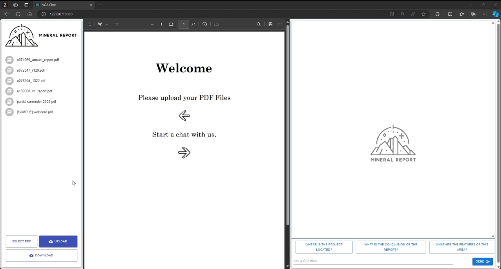

# VQA_web

Configure python virtual environment

```commandline
pip install virtualenv
virtualenv env
cd activate
pip install -r requirements.txt
```
Run `app.py`


To rebuild frontend:

install Node.js

Configure React environment
```commandline
npm install 
npm build
```
move files from `bulid` folder to `webroot` folder

